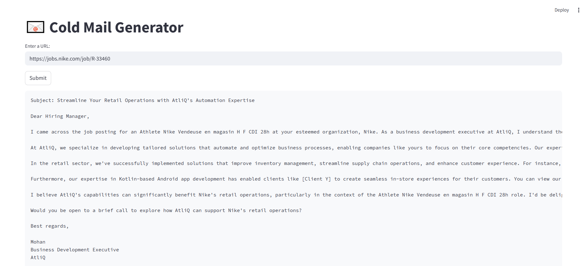

# 📧 LLM-Powered Cold Mail Generator


### This is a Streamlit-based tool that uses a Large Language Model (LLM) to scrape job descriptions from career pages, extract job details, and generate professional cold emails tailored to those roles.


## Features

- **Web Scraping**: Extracts job details from career webpages.
- **LLM Integration**: Uses Groq's LLaMA3-70B model to understand and process job data.
- **Cold Email Generator**: Generates context-aware emails tailored for business outreach.
- **Portfolio Matching**: Adds the most relevant project links from your portfolio.

## Technologies Used

- LangChain
- Streamlit
- ChatGroq (LLaMA3)
- ChromaDB
- Python 3.10+
- Poetry
- dotenv

## Setup Instructions

### 1. Clone the Repository

```bash
git clone https://github.com/dishagopani05/Cold-Mail-Generator
cd cold-mail-generator
```

### 2. Install Poetry (if not installed)

```bash
pip install poetry
```

### 3. Install Dependencies

```bash
poetry install
```

### 4. Set Environment Variables

Create a `.env` file in the project root:

```env
GROQ_API_KEY=your_groq_api_key_here
```

###  5. Run the App

```bash
poetry run streamlit run main.py
```


### Usage

1. Enter the career page URL of a company.
2. Click Submit.
3. The app will:
   - Scrape the page.
   - Extract job listings.
   - Match portfolio links based on the role.
   - Generate and display a cold email using LLM.


#### Example Output

To: careers@example.com  
Subject: Exploring Collaboration Opportunities  

Dear [Hiring Manager],

I'm Mohan, a Business Development Executive at AtliQ. Based on your recent job posting for [Role] at [Company], I wanted to share how AtliQ can help...

(Portfolio links automatically inserted)

### Screenshots


